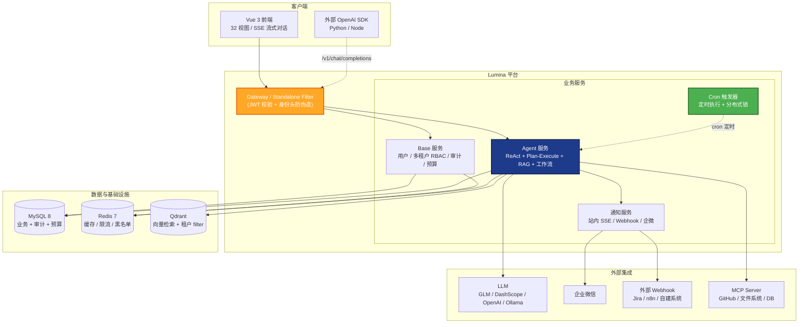

# Lumina Framework

<div align="center">

**Lumina AI Agent Platform Framework**

基于 AgentScope 和 Spring Cloud 的新一代 AI Agent 开发框架

[](https://openjdk.org/projects/jdk/21/)
[](https://spring.io/projects/spring-boot)
[](https://github.com/modelscope/agentscope-java)
[](LICENSE)

[](https://github.com/zwl467135974/lumina/actions/workflows/ci.yml)

[English](README_EN.md) | 中文

</div>

---

## 项目简介

Lumina 是一套**企业私有化 AI Agent 中台**，基于 [AgentScope Java](https://github.com/modelscope/agentscope-java) 和 [Spring Cloud Alibaba](https://spring.io/projects/spring-cloud-alibaba) 构建，主打**私有化部署、租户隔离、算得清账**——给需要私有化+多租户的中国 ToB 软件商和企业 IT 部门使用。

### 为什么选 Lumina

唯一对 Dify 开源版 / LangGraph / Spring AI Alibaba 形成**净优势**的维度是**企业级特性**：

| 能力 | Dify 开源版 | LangGraph | Spring AI Alibaba | **Lumina** |
|---|---|---|---|---|
| **行级多租户隔离** | ❌ 工作区粒度 | ❌ 不管 | ❌ 不管 | ✅ fail-closed + 集成测试 |
| **五表 RBAC + 审计** | 部分 | ❌ | ❌ | ✅ `@Audit` AOP |
| **工具级安全管线** | ❌ | ❌ | ❌ | ✅ 拦截器→审批→单调守卫 |
| **上下文工程** | 截断 | 手工管理 | 手工管理 | ✅ Token 预算 + 两级压缩 + 溢出自愈 |
| **AI 原生编排** | DSL 声明式 | 开发者写代码 | ❌ | ✅ autonomy 节点：模型生成脚本沙箱编排子 Agent |
| **预算管控（Token 计费）** | 部分 | ❌ | ❌ | ✅ 按租户/Agent 归集 |
| **Prompt 注入检测 + PII 脱敏** | 部分 | ❌ | ❌ | ✅ 11 种模式 |
| **JWT fail-fast + 身份头防伪造** | N/A | N/A | N/A | ✅ 网关入口剥离 |
| 通用 AI 应用平台 | **✅** | ❌ | ❌ | ❌ |
| 复杂状态机编排 | ❌ | **✅** | 部分 | 部分 |
| Spring 生态无缝集成 | ❌ | ❌ | **✅** | ✅ |

完整对比见 [`市场定位分析`](docs/zh/strategy/市场定位分析.md)。一句话主张：**"Dify 开源版没有的多租户/RBAC/预算/审计，Lumina 全有且带测试。"**

### 30 秒看懂

```bash
export LLM_API_KEY=your-glm-or-dashscope-key
docker compose -f docker-compose-standalone.yml up
# 打开 http://localhost:8080，admin / admin123
```

只需 MySQL + Redis（compose 自带），无需 Nacos / RocketMQ / 独立 Gateway 进程。
配好 Key 后一条命令到登录页，详见下方 [快速开始](#快速开始)。

### 适用场景

✅ **推荐**：需要私有化部署 + 多租户 + Java 技术栈（Spring Cloud Alibaba / MyBatis-Plus / Nacos）+ 成本归集 + 审计合规的企业场景
❌ **不推荐**：通用 AI 应用平台（选 Dify）、研究型复杂 Agent（选 LangGraph）、已有 Spring AI 应用加 Agent（选 Spring AI Alibaba）、Python 技术栈

### 五条主线能力

- **🏢 企业级特性** - 行级多租户隔离（fail-closed）、五表 RBAC、审计日志、预算管控、JWT fail-fast、Prompt 注入检测 + PII 脱敏、工具级安全管线（拦截器→高危工具人工审批→单调守卫，fail-closed）——全仓库最扎实、有集成测试
- **🤖 Agent 执行引擎** - AgentScope 2.0.0 ReAct/Plan-Execute、SSE 流式（REASONING/ACTING/RAG_SOURCES）、多模态、Provider Failover 主备链、上下文工程（Token 预算 + 两级压缩 + 溢出自愈）、技能渐进披露、SSE 中断合成闭合
- **🔧 工具与集成** - MCP 协议接入（stdio/SSE/streamable-http 三传输 + headers 鉴权 + 重连健康检查）、OpenAI 兼容 `/v1/chat/completions` 出口、Webhook、企业微信机器人、Code Interpreter（Docker 容器池）、超大结果外存化（spill + 按需取回）
- **📚 知识与编排** - RAG 混合检索（RRF + reranker + 5 OCR）、Flowable 7.0 DAG 工作流（7 种节点含 **autonomy 自主编排**——模型生成 JS 脚本在 GraalJS 沙箱编排子 Agent）、租户技能库（目录进上下文、全文按需加载）、Prompt 版本管理、Agent 评估回归（4 评分器 + A/B 对比）
- **🎨 工程化前端** - Vue 3 + Element Plus 33 视图、暗色主题、i18n、Agent 调试面板、动态菜单（权限下发）

### 🎓 配套教学体系（110 篇，新时代 AI 工程师养成路线）

不只是框架，还是一套**可教学的 AI Agent 工程课程**——从 LLM 基础到多 Agent 编排渐进式进阶，全部配套项目真实代码与自测题，团队拿来即用的培训教材：

| 阶段 | 内容 | 篇数 |
|---|---|---|
| [Stage 1 基础](tutorials/stage-1-foundation/) | LLM 原理、Token/上下文窗口、Prompt 工程 | 18 |
| [Stage 2 应用](tutorials/stage-2-application/) | 多租户、RBAC、审计、RAG、成本管理 | 16 |
| [Stage 3 进阶](tutorials/stage-3-mastery/) | 架构模式、可观测性、评估回归、生产部署 | 16 |
| [Stage 4 AI Agent](tutorials/stage-4-ai-agent/) | Agent 模式、AgentScope、工作流编排、上下文工程 | 59 |

教学与代码同源维护——每个新版本功能同步更新对应教程（见 [tutorials/README.md](tutorials/README.md)）。

<details>
<summary><b>📋 完整能力清单（点击展开）</b></summary>

- **微服务架构** - Spring Cloud Alibaba，Gateway(8080) + Agent(8081) + Base(8082)；**也支持 standalone 单体模式**（仅 MySQL+Redis 两件套）
- **简化分层架构** - API/Service/Domain/Infrastructure 四层
- **多轮对话与记忆** - Redis 热记忆 + DB 冷存储 + Reflective Memory（LLM 提取事实注入）
- **上下文工程** - Token 预算装填、两级压缩（免模型修剪 + 检查点摘要）、溢出紧急压缩自愈、SSE 中断合成闭合
- **技能系统（渐进披露）** - 租户技能库，目录进上下文、`util.loadSkill` 按需加载全文、注入检测 fail-closed
- **异步任务执行** - 提交即返回 taskId，后台执行，状态查询，真取消（中断执行）+ 重启中断对账（INTERRUPTED）
- **成本管理** - 模型价格表 + Token 计费 + 消费汇总仪表盘 + 趋势图表
- **全链路可观测** - MDC 结构化日志 + Micrometer 指标 + OpenTelemetry 分布式追踪 + AgentTurnEvent 事件总线（含 INTERRUPTED 语义）
- **工程化** - 统一错误码、Flyway V1–V52、网关限流、Resilience4j 熔断器/重试、SpringDoc OpenAPI（Swagger UI）
- **响应式编程** - Project Reactor + Context Propagation，跨线程租户上下文传递
- **多 LLM 支持** - DashScope/OpenAI/DeepSeek/Claude/Gemini/Ollama + OpenAI 兼容预设（GLM/Kimi/豆包零代码扩展）
- **A/B Testing** - 实验框架，按权重流量分发 + 同会话粘滞 + 效果报告

</details>

### 架构

> 两种部署模式共享同一套业务代码：**standalone**（单体，仅 MySQL+Redis，体验/PoC）和**微服务**（Gateway+Base+Agent 三服务，生产）。所有外部集成都可通过 Webhook / OpenAI 兼容出口 / MCP 接入。



---

## 项目结构

### 后端模块

```
lumina/
├── lumina-common/              # 公共模块（统一响应、异常体系、工具类）
├── lumina-framework/           # 框架模块（配置类、全局异常处理、Web 配置）
├── lumina-agent-core/          # Agent 核心（执行引擎、Flowable 工作流、配置加载、工具管理、MCP 接入、Resilience4j）
├── lumina-gateway/             # API 网关（统一入口、JWT 认证、OpenAI 兼容端点路由）
├── lumina-standalone/          # 单体模式启动器（base+agent+notification 合一，仅 MySQL+Redis）
└── lumina-modules/             # 业务模块聚合器
    ├── lumina-business-base/       # 基础业务（用户、角色、权限、多租户、审计、预算、API Token）
    ├── lumina-business-agent/      # Agent 业务（Agent 配置、知识库、工作流、Cron 触发器、评估、Prompt）
    └── lumina-business-notification/ # 通知中心（站内 SSE、Webhook、企业微信）
```

### 前端项目

```
lumina-frontend/
├── src/
│   ├── api/                    # API 接口定义
│   ├── components/             # 公共组件
│   ├── composables/            # 组合式函数
│   ├── layouts/                # 布局组件
│   ├── router/                 # 路由配置
│   ├── stores/                 # 状态管理 (Pinia)
│   ├── types/                  # TypeScript 类型定义
│   ├── utils/                  # 工具函数
│   └── views/                  # 页面组件
└── package.json
```

### 模块说明

#### 后端模块

| 模块 | 说明 | 依赖 |
|------|------|------|
| **lumina-common** | 公共组件模块，提供统一响应、异常体系、工具类、常量 | 无 |
| **lumina-framework** | 框架基础设施模块，提供配置类、全局异常处理、Web 配置 | lumina-common |
| **lumina-agent-core** | Agent 执行引擎核心模块，封装 AgentScope 能力（ReAct Agent、记忆管理、工具动态注册） | lumina-common |
| **lumina-gateway** | API 网关模块，作为统一入口，支持 JWT 认证与 Nacos 动态路由 | lumina-common, lumina-framework |
| **lumina-business-base** | 基础业务模块，提供用户、角色、权限、租户管理（多租户 RBAC 完整实现） | lumina-common, lumina-framework |
| **lumina-business-agent** | Agent 业务模块，提供 Agent 配置、会话、知识库、工作流编排、Prompt 管理、异步任务、成本管理、安全防护 | lumina-common, lumina-agent-core, lumina-framework |
| **lumina-modules** | 业务模块聚合器，按需添加业务模块 | 以上模块 |

#### 前端项目

| 项目 | 说明 | 技术栈 |
|------|------|--------|
| **lumina-frontend** | 前端项目，基于 Vue 3 + TypeScript + Element Plus | Vue 3, TypeScript, Element Plus, Pinia, Vite |

---

## 快速开始

Lumina 提供两种启动方式：

- **standalone 单体模式（推荐体验）** — 只需 MySQL + Redis，5 分钟跑起来。无需 Nacos / RocketMQ / 独立 Gateway 进程
- **微服务模式（推荐生产）** — Gateway + Agent + Base 三服务 + Nacos + 可选 RocketMQ

### 方式一：standalone 单体模式（推荐）

#### 环境要求（仅两件套）

- **Docker** + Docker Compose（最简单）
- 或 **JDK 21+** + **Maven 3.9+** + **MySQL 8.0+** + **Redis 7.0+**

#### 一键启动

```bash
git clone https://github.com/zwl467135974/lumina.git
cd lumina

# 必填 LLM API Key（智谱 GLM / 阿里 DashScope 等）
export LLM_API_KEY=your-api-key

# 一条命令拉起 MySQL + Redis + Lumina（端口 8080）
docker compose -f docker-compose-standalone.yml up
```

启动后：
- 健康检查：http://localhost:8080/actuator/health
- 默认账号：`admin` / `admin123`（系统租户 tenant_id=0）

详见 [`standalone 部署指南`](docs/zh/deployment/standalone部署.md)。

### 方式二：微服务模式（生产部署）

#### 环境要求

##### 后端环境

- **JDK 21+** - [下载](https://adoptium.net/)
- **Maven 3.9+** - [下载](https://maven.apache.org/download.cgi)
- **MySQL 8.0+** - [下载](https://dev.mysql.com/downloads/mysql/)
- **Redis 7.0+** - [下载](https://redis.io/download)
- **Nacos 3.1.1+** - [下载](https://nacos.io/zh-cn/docs/quick-start.html)（**必装**：服务发现与配置中心）

##### 前端环境

- **Node.js 20+** - [下载](https://nodejs.org/)
- **pnpm 8+** (推荐) 或 npm 9+ / yarn 1.22+ - [下载](https://pnpm.io/)

#### 安装步骤

##### 1. 克隆项目

```bash
git clone https://github.com/zwl467135974/lumina.git
cd lumina
```

##### 2. 启动基础设施

**启动 MySQL**

```bash
# 创建数据库
mysql -u root -p
CREATE DATABASE lumina_dev CHARACTER SET utf8mb4 COLLATE utf8mb4_general_ci;
```

**启动 Redis**

```bash
redis-server
```

**启动 Nacos**

```bash
# 下载 Nacos
wget https://github.com/alibaba/nacos/releases/download/3.1.1/nacos-server-3.1.1.zip

# 解压并启动
unzip nacos-server-3.1.1.zip
cd nacos/bin
./startup.sh -m standalone
```

访问 Nacos 控制台：http://localhost:8848/nacos（默认账号密码：nacos/nacos）

#### 3. 配置环境变量

```bash
# Linux/Mac
export LLM_API_KEY=your_api_key_here

# Windows (PowerShell)
$env:LLM_API_KEY="your_api_key_here"
```

#### 4. 初始化数据库（Flyway 自动迁移）

启动 base 服务时 Flyway 自动执行建表与初始化数据（V1–V49+），**无需手动执行 SQL**：

```bash
cd lumina-modules/lumina-business-base
mvn spring-boot:run
# 首次启动自动创建表 + 初始 admin 数据
```

迁移脚本位于 `lumina-modules/lumina-business-base/src/main/resources/db/migration/`。

**默认管理员账号**：
- 用户名：`admin`
- 密码：`admin123`
- 租户：SYSTEM（系统租户，tenant_id=0）
- 角色：SUPER_ADMIN（超级管理员）

#### 5. 启动后端服务

**启动 Gateway**

```bash
cd lumina-gateway
mvn spring-boot:run
```

访问 Gateway：http://localhost:8080

**启动 Base 服务**（可选，用于用户管理）

```bash
cd lumina-modules/lumina-business-base
mvn spring-boot:run
```

Base 服务访问：http://localhost:8082

#### 6. 启动前端项目

```bash
# 进入前端目录
cd lumina-frontend

# 安装依赖
pnpm install

# 启动开发服务器
pnpm dev
```

访问前端：http://localhost:3000

**注意**: 前端开发服务器已配置代理，API 请求会自动转发到后端 Gateway (http://localhost:8080)

---

## 开发指南

### 多租户用户管理

Lumina 提供完整的多租户用户管理功能，基于 `lumina-business-base` 模块实现。

**核心特性**：
- **多租户隔离**：每个租户的用户数据严格隔离（ToB 场景）
- **RBAC 权限模型**：用户 → 角色 → 权限三级权限体系
- **角色管理**：角色作为权限集合，可配置给用户使用
- **分级管理**：
  - 超级管理员（SUPER_ADMIN）：可管理所有租户，拥有所有权限
  - 租户管理员（TENANT_ADMIN）：只能管理本租户用户和角色
  - 普通用户（TENANT_USER）：基本权限

**使用方式**：

1. **用户登录**：
```bash
curl -X POST http://localhost:8080/api/v1/base/auth/login \
  -H "Content-Type: application/json" \
  -d '{
    "username": "admin",
    "password": "admin123",
    "tenantId": 0
  }'
```

2. **Gateway 传递用户信息**：
Gateway 自动将用户信息通过 HTTP Header 传递给下游服务：
- `X-User-Id`: 用户 ID
- `X-Username`: 用户名
- `X-Tenant-Id`: 租户 ID
- `X-Roles`: 角色列表（逗号分隔）
- `X-Permissions`: 权限列表（逗号分隔）

3. **在业务代码中获取用户信息**：
```java
// 从 HttpServletRequest 中获取
String userId = request.getHeader("X-User-Id");
String tenantId = request.getHeader("X-Tenant-Id");
String[] roles = request.getHeader("X-Roles").split(",");
```

### 创建业务模块

#### 1. 创建传统业务模块

```bash
# 在 lumina-modules 下创建模块
mkdir -p lumina-modules/lumina-business-order/src/main/java/io/lumina/order
```

创建 `pom.xml`：

```xml
<parent>
    <groupId>io.lumina</groupId>
    <artifactId>lumina</artifactId>
    <version>1.0.0-SNAPSHOT</version>
    <relativePath>../../pom.xml</relativePath>
</parent>

<artifactId>lumina-business-order</artifactId>

<dependencies>
    <dependency>
        <groupId>io.lumina</groupId>
        <artifactId>lumina-common</artifactId>
    </dependency>
    <dependency>
        <groupId>io.lumina</groupId>
        <artifactId>lumina-framework</artifactId>
    </dependency>
</dependencies>
```

#### 2. 创建 Agent 业务模块

```bash
# 在 lumina-modules 下创建模块
mkdir -p lumina-modules/lumina-agent-customer/src/main/java/io/lumina/agent/customer
```

创建 `pom.xml`：

```xml
<parent>
    <groupId>io.lumina</groupId>
    <artifactId>lumina</artifactId>
    <version>1.0.0-SNAPSHOT</version>
    <relativePath>../../pom.xml</relativePath>
</parent>

<artifactId>lumina-agent-customer</artifactId>

<dependencies>
    <dependency>
        <groupId>io.lumina</groupId>
        <artifactId>lumina-common</artifactId>
    </dependency>
    <dependency>
        <groupId>io.lumina</groupId>
        <artifactId>lumina-agent-core</artifactId>
    </dependency>
    <dependency>
        <groupId>io.lumina</groupId>
        <artifactId>lumina-framework</artifactId>
    </dependency>
</dependencies>
```

### 分层架构规范

Lumina 采用简化分层架构：

```
lumina-modules/lumina-{domain}/
└── src/main/java/io/lumina/{domain}/
    ├── api/                    # 接口层
    │   ├── controller/         # REST 控制器
    │   └── dto/                # 数据传输对象
    │
    ├── service/                # 业务服务层（核心）
    │   ├── {业务}Service.java
    │   └── impl/
    │
    ├── domain/                 # 领域模型层
    │   ├── model/              # 领域实体
    │   └── enums/              # 领域枚举
    │
    └── infrastructure/         # 基础设施层
        ├── mapper/             # MyBatis Mapper
        └── entity/             # 数据库实体 (DO)
```

详细规范参考：[Lumina开发规范与编码标准.md](docs/guides/Lumina开发规范与编码标准.md)

### 使用 Agent 执行引擎

```java
@Autowired
private AgentExecutionEngine agentExecutionEngine;

public String executeAgent(String task) {
    AgentConfig config = new AgentConfig();
    config.setAgentName("customer-service");
    config.setAgentType("ReAct");

    AgentConfig.LLMConfig llmConfig = new AgentConfig.LLMConfig();
    llmConfig.setModelType("dashscope");
    llmConfig.setModelName("qwen-max");
    config.setLlmConfig(llmConfig);

    ExecuteResult result = agentExecutionEngine.executeSync("customer-service", task, config);
    return result.getResult();
}
```

---

## 技术栈

### 后端技术栈

| 分类 | 技术 | 版本 | 说明 |
|------|------|------|------|
| **运行环境** | Java | 21 (LTS) | 最新 LTS 版本，支持虚拟线程 |
| **框架** | Spring Boot | 3.3.5 | 微服务基础框架 |
| | Spring Cloud | 2023.0.3 | 微服务组件 |
| | Spring Cloud Alibaba | 2023.0.1.2 | 阿里微服务组件 |
| **Agent 框架** | AgentScope Java | 2.0.0 | Agent 开发框架 |
| | Project Reactor | 2025.0.2 | 响应式编程 |
| **数据持久** | MyBatis | 3.0.3 | ORM 框架 |
| | MyBatis-Plus | 3.5.7 | MyBatis 增强工具 |
| **缓存** | Redisson | 3.24.3 | Redis 客户端 |
| **工作流引擎** | Flowable | 7.0 | DAG 工作流引擎（BPMN/流程编排） |
| **容错** | Resilience4j | 2.2.0 | 熔断器/重试/限流 |
| **服务治理** | Nacos | 3.1.1+ | 服务注册/配置中心 |
| **文档** | SpringDoc | 2.6.0 | API 文档生成 |
| **JSON 处理** | Jackson | 2.20.1 | 统一 JSON 处理库 |

### 前端技术栈

| 分类 | 技术 | 版本 | 说明 |
|------|------|------|------|
| **框架** | Vue | 3.4+ | 渐进式 JavaScript 框架 |
| **语言** | TypeScript | 5.3+ | 类型安全的 JavaScript |
| **构建工具** | Vite | 5.0+ | 快速构建工具 |
| **UI 组件库** | Element Plus | 2.5+ | Vue 3 组件库 |
| **状态管理** | Pinia | 2.1+ | Vue 官方状态管理库 |
| **路由** | Vue Router | 4.2+ | Vue 官方路由库 |
| **HTTP 客户端** | Axios | 1.6+ | HTTP 请求库 |
| **工具库** | dayjs | 1.11+ | 日期处理库 |
| **样式** | SCSS | 1.69+ | CSS 预处理器 |

---

## 文档

### 教学体系（110 篇）

- [教学总览](tutorials/README.md) - 四阶段渐进式 AI Agent 工程师养成路线（含自测题）
- [Stage 1 基础](tutorials/stage-1-foundation/) - LLM 原理 / Token / Prompt 工程
- [Stage 2 应用](tutorials/stage-2-application/) - 多租户 / RBAC / RAG / 成本
- [Stage 3 进阶](tutorials/stage-3-mastery/) - 架构 / 可观测 / 评估 / 部署
- [Stage 4 AI Agent](tutorials/stage-4-ai-agent/) - Agent 模式 / 工作流 / 上下文工程

### 快速开始

- [项目 README](README.md) - 项目介绍和快速开始
- [快速开始](docs/zh/快速开始.md) - 5 分钟跑起来
- [部署指南](docs/zh/deployment/部署指南.md) - Docker Compose 一键部署 + 本地开发 + K8s 参考
- [配置说明](docs/zh/deployment/配置说明.md) - JWT、白名单、租户隔离等完整配置
- [测试指南](TESTING.md) - 测试验证步骤和场景

### 开发指南

- [开发规范与编码标准](docs/zh/guides/Lumina开发规范与编码标准.md) - 开发规范
- [Agent 开发指南](docs/zh/guides/Agent开发指南.md) - Agent 开发、执行、安全管线
- [工作流设计指南](docs/zh/guides/工作流设计指南.md) - 多 Agent 编排
- [业务模块开发指南](docs/zh/guides/业务模块开发指南.md) - 业务模块开发
- [前端开发指南](docs/zh/guides/前端开发指南.md) - 前端开发指南
- [工具开发指南](docs/zh/guides/工具开发指南.md) - Agent 工具开发
- [配置管理规范](docs/zh/guides/配置管理规范.md) - 配置管理规范
- [数据库配置指南](docs/zh/guides/数据库配置指南.md) - 数据库配置

### 架构设计

- [Agent 执行引擎设计](docs/zh/architecture/Agent执行引擎设计.md) - Agent 核心设计
- [项目结构设计](docs/zh/architecture/项目结构设计.md) - 项目结构说明
- [Lumina 模块设计](docs/zh/architecture/Lumina模块设计.md) - 模块设计文档
- [Lumina 技术选型方案](docs/zh/architecture/Lumina技术选型方案.md) - 技术选型说明
- [前端架构设计](docs/zh/architecture/前端架构设计.md) - 前端架构设计
- [架构模式分析与建议](docs/zh/architecture/架构模式分析与建议.md) - 架构模式分析

### English Docs

- [Quick Start](docs/en/QUICK_START.md) | [Architecture](docs/en/ARCHITECTURE.md) | [Agent Dev](docs/en/AGENT_DEVELOPMENT.md) | [Workflow](docs/en/WORKFLOW_DESIGN.md)

---

## 常见问题

### 1. Java 版本兼容性

AgentScope Java 使用 Java 17 编译，但 Lumina 使用 Java 21。由于 Java 21 向下兼容，可以直接使用。

### 2. Maven 依赖下载慢

在 `~/.m2/settings.xml` 中配置阿里云镜像：

```xml
<mirrors>
    <mirror>
        <id>aliyun-maven</id>
        <mirrorOf>*</mirrorOf>
        <name>Aliyun Maven</name>
        <url>https://maven.aliyun.com/repository/public</url>
    </mirror>
</mirrors>
```

### 3. Nacos 连接失败

检查 Nacos 是否启动，访问 http://localhost:8848/nacos 确认。

### 4. 前端依赖安装失败

如果使用 pnpm 安装依赖失败，可以尝试：

```bash
# 清除缓存
pnpm store prune

# 重新安装
pnpm install
```

或者使用 npm：

```bash
npm install
```

### 5. 前端代理配置

前端开发服务器已配置代理，API 请求会自动转发到后端。如需修改代理地址，编辑 `lumina-frontend/vite.config.ts` 中的 `proxy` 配置。

### 6. 前后端跨域问题

开发环境下，前端已配置代理，不会出现跨域问题。生产环境需要在 Gateway 中配置 CORS。

---

## 贡献指南

欢迎贡献代码！请遵循以下步骤：

1. Fork 本仓库
2. 创建特性分支 (`git checkout -b feature/AmazingFeature`)
3. 提交更改 (`git commit -m 'Add some AmazingFeature'`)
4. 推送到分支 (`git push origin feature/AmazingFeature`)
5. 提交 Pull Request

---

## 许可证

本项目采用 Apache License 2.0 许可证。详见 [LICENSE](LICENSE) 文件。

---

## 联系方式

- 项目主页：[https://github.com/zwl467135974/lumina](https://github.com/zwl467135974/lumina)
- 问题反馈：[Issues](https://github.com/zwl467135974/lumina/issues)

---

## 项目状态

### v2.0.0 已完成

**Agent 编排引擎（P1）**
- ✅ DAG 工作流引擎：Agent / Condition / Loop / Parallel / Transform / Human 6 种节点类型
- ✅ 5 种协作模式 YAML 模板：Supervisor-Worker / Debate / Pipeline / Router / Human-in-the-Loop
- ✅ 工作流持久化：定义表 + 实例表 + 执行日志表（Flyway V8）
- ✅ 管理 API：创建/发布/执行/查询 + 模板列表
- ✅ 前端工作流管理页

**Prompt 管理（V9）**
- ✅ DB 持久化 + 版本管理 + 发布/激活
- ✅ Agent 执行链路运行时接入：优先读 DB 激活 Prompt（租户优先 + 全局回退），未命中回退 classpath 内置
- ✅ 前端管理页 + Agent 列表/表单/详情页运行时 Prompt 可见性

**流式增强 + 调试（P2）**
- ✅ 多模态流式：图片 + 文本混合输入，LLM 流式回复
- ✅ Agent 调试面板：工具调用记录 + 推理过程展示

**生产可用性（P3）**
- ✅ 异步任务执行：提交即返回 taskId，后台线程池执行，状态查询 + 独立任务列表页（Flyway V10）
- ✅ 成本管理：模型价格表 + Token 计费 + 消费汇总仪表盘 + 趋势图表（Flyway V11）
- ✅ 安全防护：Prompt 注入检测（11 种模式）+ 输出 PII 脱敏 + 频率限制（Redis 滑动窗口）+ 内容审核

**Agent 评估框架（E1）**
- ✅ YAML 数据集管理 + 文件上传导入
- ✅ 4 种评分器：精确匹配 / 关键词包含 / 语义相似度（Embedding 余弦） / LLM Judge（1-5 分制）
- ✅ 评估报告：分类统计 + ECharts 柱状图 + 历史趋势折线图
- ✅ 异步评估（大数据集）+ A/B 两次评估对比 + CSV 导出（Flyway V13-V14）

**部署 + 文档（P4-P5）**
- ✅ Helm Chart 全量模板（Gateway / Business-Base / Agent-Service / Frontend / Ingress + HPA）
- ✅ 英文 README（README_EN.md）
- ✅ Apache 2.0 License + CHANGELOG.md

**测试**
- ✅ 后端 770+ 测试（单元 + 集成，全模块 `mvn verify` 通过）
- ✅ 前端 103 测试（Vitest 单元测试）
- ✅ CI/CD 双流水线（GitHub Actions：后端 mvn verify + 前端 pnpm build + pnpm test）

**继承 v1.3.0 核心能力**
- ✅ 响应式上下文传递 + 敏感配置环境变量化
- ✅ 统一错误码 + Flyway V1–V49+ + 网关限流 + API 版本策略
- ✅ 流式输出（SSE）+ 多轮对话/记忆管理 + Token 用量统计
- ✅ 多模型适配（DashScope/OpenAI/DeepSeek/Claude/Ollama + 硅基流动/智谱/Kimi/豆包/Minimax）
- ✅ RAG 知识库（多 Embedding + Qdrant 向量存储 + 文档管线）
- ✅ 工具调用可观测（记录/统计/熔断器）+ 审计日志（@Audit AOP + 异步）
- ✅ 可观测性：MDC 结构化日志 + Micrometer 指标 + OpenTelemetry 全链路追踪
- ✅ 前端：动态菜单 + Agent 对话（SSE 流式）+ 暗色主题 + i18n 国际化

相关文档：
- [v2.0.0 路线图](docs/zh/roadmap/v2.0路线图.md) - 完整需求文档与完成状态
- [v3.0.0 路线图](docs/zh/roadmap/v3.0路线图.md) - 稳定化与生产就绪
- [Prompt 运行时规则](docs/zh/design/Prompt运行时规则.md) - Prompt 生效规则说明
- [部署指南](docs/zh/deployment/部署指南.md) - Docker Compose 一键部署 + 本地开发 + K8s 参考

### v3.0.0 稳定化

- ✅ 数据层修复：字段对齐 + Agent 配置全链路 + 权限种子覆盖所有模块
- ✅ 接线断裂修复：Agent LLM 配置/工具、知识库 kbId、菜单 DB 驱动、成本真实模型
- ✅ Luminous 暗色主题设计系统（130 CSS 变量 + Element Plus 覆盖）
- ✅ i18n 全量国际化（350+ key，中英文切换）
- ✅ Dashboard 首页 + 审计日志页 + 403/401 错误页
- ✅ Nacos 配置统一（本地极简 + nacos-config 完整）
- ✅ 前端设计技能包（自进化：DESIGN.md + ui-learnings.md）
- ✅ Flyway V17-V33（权限/字段/模型/通知/种子数据/评估回归/通知菜单/Provider优先级/A-B测试/长期记忆）

### v3.2.0 能力完善与验证

- ✅ MCP 协议接入（stdio/SSE/streamable-http 三传输 + headers 鉴权 + 重连健康检查 + 工具自动注册 + 监控 API）
- ✅ 通用工具系统迁移（HTTP/时间/搜索/计算工具从 base 迁至 agent-core，解决跨服务可见性）
- ✅ 网络搜索适配层（智谱/Tavily/SerpAPI/Brave 四引擎 + 配置驱动切换）
- ✅ 通知中心独立模块（站内通知 + 已读管理 + 前端通知页面 + Flyway V26/V30）
- ✅ LumUploader 可复用上传组件 + 多模态扩展支持 PDF/Word
- ✅ 端到端全链路验证（ReAct 工具调用 + MCP echo server + 流式 SSE + RAG Qdrant）
- ✅ 测试扩充至 600+（MCP/搜索/工具/工作流节点/Flowable BPMN/知识库全覆盖）
- ✅ CI/CD 修复（Redis 密码 + Dockerfile 多模块构建 + CD 上下文）
- ✅ 异常规范化（17 处 RuntimeException → BusinessException + ErrorCode）

### v3.4 战略补齐：企业集成出口 + standalone

- ✅ **standalone 单体模式** — base+agent+notification 合并为单 jar，仅需 MySQL+Redis，`docker compose up` 一条命令到登录页
- ✅ **OpenAI 兼容出口** — `/v1/chat/completions` + `/v1/models`，标准 OpenAI SDK 直接调用，API Token（sk-xxx）管理
- ✅ **向量层多租户隔离修复** — Qdrant payload filter 下推 + tenant_id 索引（之前是安全洞）
- ✅ **MCP 生产化** — streamable-http + headers 鉴权 + 重连健康检查 + 运行时动态注册
- ✅ **Webhook 系统** — per-user/per-category 订阅 + HMAC-SHA256 签名 + 连续失败自动禁用
- ✅ **企业微信机器人** — markdown 着色 + 4096 字节分片 + 限频
- ✅ 定位重写：竞品对比表 + 收窄到"企业私有化 Agent 中台"

### v3.5 生产就绪：自动化 + 可观测

- ✅ **Cron 触发器** — Agent 按定时执行，Redisson 分布式锁防多实例重复，misfire 策略，复用 executeTask 管线
- ✅ **Grafana 3 个预置仪表盘** — Agent 执行 / 工具+RAG / 工作流+Trigger，provisioning 开箱即用
- ✅ **监控叠加文件** — `docker-compose-monitoring.yml` 任意模式一键加监控
- ✅ 230 测试通过（v3.4 的 208 + 22 个 trigger 测试）

### v3.6 企业级加固

- ✅ **模型价格管理** — 模型输入/输出价格全量 CRUD（Controller + 前端页面），成本计算不再回退硬编码默认值（Flyway V44 灌入 GLM/Kimi/DashScope/Claude/Ollama 18 条价格）
- ✅ **Controller 权限审计** — Agent 模块 18 个 Controller 全部补 `@RequirePermission`，`ControllerPermissionTest` 回归验证
- ✅ **工作流 PAUSED 上下文修复** — 人工审批节点暂停时持久化 `instance.output`，resume 正确恢复全部变量
- ✅ **Token 追踪修复** — 同步/多模态/流式三条执行路径均持久化 token 用量到 `agent_task` 表，成本仪表盘显示真实数据
- ✅ **API 文档完善** — SpringDoc OpenAPI（Swagger UI）+ 全部 Controller 补 `@Tag`/`@Operation` 注解 + JWT 安全方案配置
- ✅ **预算在途追踪** — 预算检查计入 RUNNING 状态任务（防并发超额），Redis 告警去重（防轰炸）
- ✅ **MCP 运行时注册** — `registerServer()` 自动拉取工具并注册到 `EnhancedToolManager`
- ✅ **限流与并发控制** — Per-Agent rate limit（Redis 滑动窗口）+ maxConcurrent 信号量（Flyway V42/V43）

### v3.7 AgentScope 2.0 升级 + Trace 可观测性

- ✅ **AgentScope 2.0.0 升级** — 从 1.0.7 升级，模型扩展包路径迁移，`.memory()` → `.stateStore()`
- ✅ **RedisAgentStateStore** — 跨实例记忆共享，AgentState Redis 持久化（7 天 TTL）
- ✅ **推理链 Trace 系统** — LuminaTraceTracer 全链路拦截 + Reactor Context 传播 + 前端可视化 + 数据清理
- ✅ **全路径覆盖** — 同步/流式/PlanAndExecute/FailoverChain 四条执行路径全覆盖

### v3.8 AI 核心能力补全

- ✅ **Agent 循环限制** — maxIters 安全阀，防止死循环烧 Token
- ✅ **结构化输出** — JSON Mode，约束 LLM 返回合法 JSON
- ✅ **上下文压缩** — LLM 滚动摘要旧消息，不直接丢弃
- ✅ **多 Agent 协作** — Supervisor 模式，LLM 路由器自动选专家
- ✅ **动态模型路由** — 复杂度判断→便宜/强力模型自动切换
- ✅ **输出护栏** — 关键词拦截 + 长度截断 + 重复检测

### v3.9 生产级完善

- ✅ **DB 冷启记忆恢复** — Redis 过期后从 MySQL 恢复 + warm-up 回填
- ✅ **会话级 Token 预算** — CONVERSATION scope，单会话花费限制
- ✅ **工具错误恢复** — 增强错误消息，LLM 自动修正参数重试
- ✅ **自动会话管理** — `/chat` 端点，前端无需手动管 conversationId
- ✅ **知识库级分块策略** — 每个 KB 独立配 chunkSize/overlap/splitStrategy
- ✅ **教学文档 58 篇** — 从 47 篇扩到 58 篇，含自测题答案，全部新功能配套教学

### v3.10 全面审查修复（Release 质量加固）

基于四维度系统审查（CI 技术债 / 分层架构 / 异常处理 / 新功能质量），修复 6 个 release 阻塞项 + 规范统一：

- 🔒 **安全修复** — LongTermMemoryController 鉴权漏洞（delete/deleteAll 缺 userId 校验 → 全表删除风险）
- 🏗 **架构合规** — 2 个 Controller 抽 Service 层 + VO，DO 不再出 API 边界
- 🐛 **功能 bug ×3** — 冷启动取最近而非最早消息；模型路由用便宜模型判复杂度；MultiAgent 路由严格匹配
- ⚡ **性能** — 冷启动 warm-up 从 300 次 Redis 往返降到 3 次
- 📊 **可观测** — 状态保存/配置热更新失败加监控 counter；MultiAgent 汇总过程接入 Trace
- 📐 **规范** — 错误码语义修正（MODEL_NOT_FOUND）；Jackson 实例统一；依赖注入全部构造器化；guardrail 阈值可配

### v3.11 上下文工程 + 工具安全 + 技能与自主编排（融合 DeepSeek Harness 设计）

Agent 核心能力代际升级，机制移植自 [DeepSeek Harness](https://github.com/deepseek-ai/deepseek-harness)、架构不变：

- 🧠 **上下文工程** — Token 估算 + 输入侧预算（默认 16000，替换硬编码 20 条窗口）；两级压缩（免模型确定性修剪 + 8 段 LLM 检查点摘要，KV 前缀对齐 + 收缩硬保证）；溢出紧急压缩自愈（同步/流式）
- 🔐 **工具安全管线**（开源竞品空白） — 拦截器链 → 高危工具人工审批（allow-once，通知渠道，fail-closed）→ 单调守卫（拒绝不可被任何策略翻转）；配置名单 deny-tools/approval-tools，默认关闭
- 🩹 **失败恢复** — SSE 中断合成闭合（半截回复落库 + 标记，消除孤儿消息）；流式反思记忆修复；异步任务真取消（中断执行线程，停止 Token 消耗）；服务重启遗留任务标记 INTERRUPTED（结果未知 ≠ 失败）
- 📦 **工具结果外存化** — 超大结果全文存档（V51），模型只看预览 + `util.getArtifact` 按需取回
- 🧩 **技能系统渐进披露**（V52） — 租户级技能库：系统提示只注入目录（名称+描述，几百 token），模型按需 `util.loadSkill` 加载全文；每次重读不缓存，改了立即生效；内容过注入检测（fail-closed）
- 🤖 **自主编排节点**（workflow 第 7 种节点） — 模型/配置生成的 JS 脚本在 GraalJS 沙箱内编排子 Agent：`agent()/parallel()/pipeline()/log()` 四个桥接函数；无宿主访问/无 IO 沙箱，总量/并发/条目/超时四重限额，返回值纯 JSON 物化校验（拒 `__proto__` 载荷），超时有界宽限强杀
- 📡 **观测事件总线** — `AgentTurnEvent` 四阶段事件（含 INTERRUPTED 语义），指标消费只加监听器不改引擎
- 🛡 **MultiAgent 委派权限冻结** — 子 Agent 工具白名单收敛为父白名单子集（交集为空即空集），专家结果结构化回传（token/耗时/成败归因）
- ✅ 新增 45+ 单测（沙箱逃逸/单调守卫/预算装填等），agent-core 373 全绿

---

**Lumina Framework** - 让 AI Agent 开发更简单 🚀
