# 前端操作指南 — 纯浏览器 UI 完成全部 16 项能力验证

> 如果你不想写一行 curl 命令，按这个指南在浏览器里也能完成全部操作。每一步都配有实际截图。
> 前置条件：Lumina standalone 已启动（端口 8080），前端已启动（端口 5173）。

---

## 准备

1. 打开浏览器访问 `http://localhost:5173`
2. 登录：用户名 `admin`，密码 `admin123`

登录后进入 Dashboard：

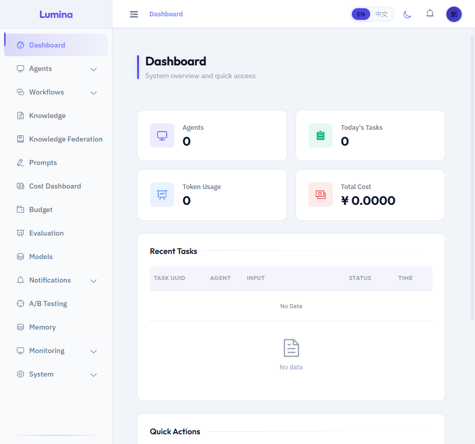

Dashboard 展示 Agent 数量、今日任务、Token 用量、总成本，以及快捷操作入口。

---

## ④ 知识库管理 + 隔离

### 创建知识库

1. 左侧菜单 → **Knowledge**（知识库）
2. 切换到 **Knowledge Federation**（知识联邦）tab
3. 点击「New Knowledge Base」

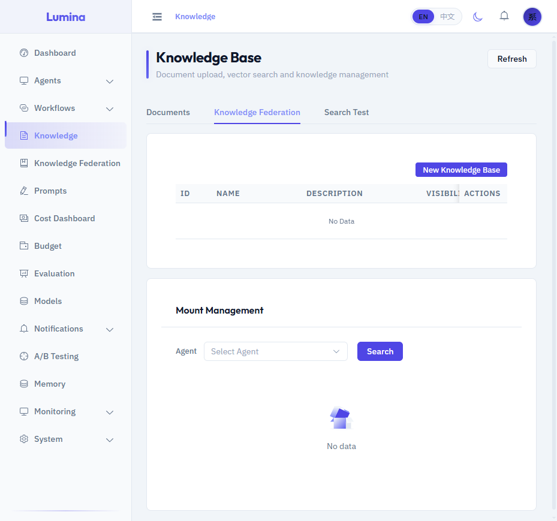

4. 填写：名称 `Ops Knowledge Base`，描述 `Nginx/Database/Incident Response SOP`

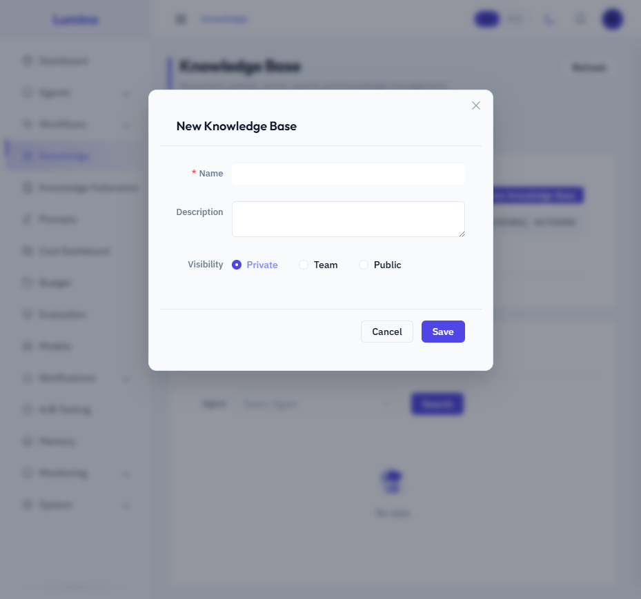

5. 点击 Save 保存

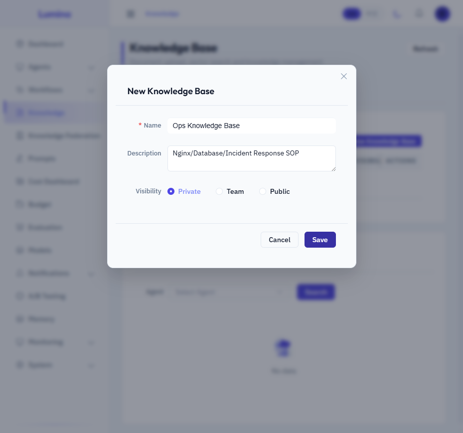

### 上传 SOP 文档

1. 切回 **Documents** tab
2. 点击「Upload Document」或拖拽文件到上传区
3. 依次上传 3 个文件：
   - `examples/ops-platform/data/kb-nginx-sop.md`
   - `examples/ops-platform/data/kb-database-sop.md`
   - `examples/ops-platform/data/kb-incident-response.md`
4. 等待文档状态变为「已分片」

> 也可用 curl 快速上传（见 [step-by-step.md](step-by-step.md) 步骤 1-2）

---

## ① Agent 执行 + ⑤ 自定义工具 + ⑩ 限流/并发

### 创建运维 Agent

1. 左侧菜单 → **Agents** → **Agent List**


2. 点击「Create Agent」
3. 填写：
   - 名称：`Ops Inspector`
   - 类型：`ops-inspector`
   - 工具：勾选 `ops.readLogs`、`ops.readMetrics`、`ops.executeCommand`
   - 知识库：勾选「Ops Knowledge Base」
   - 限流：`10`（每分钟最多 10 次）
   - 并发：`1`（最大并发 1）

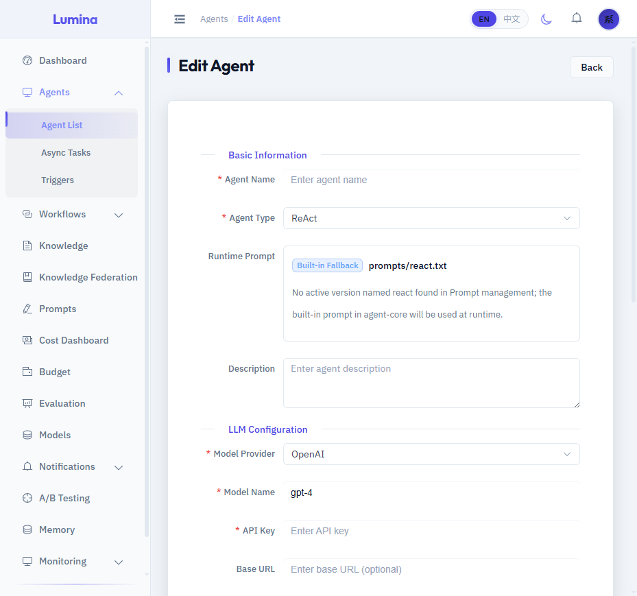

4. 保存后返回列表

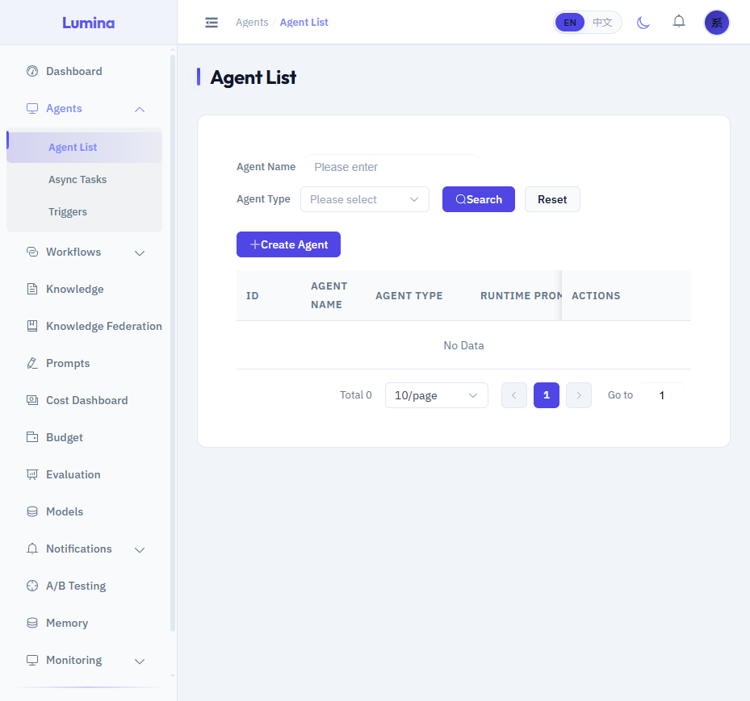

### 查看 Agent 详情 + 执行

1. 点击 Agent 名称进入详情页

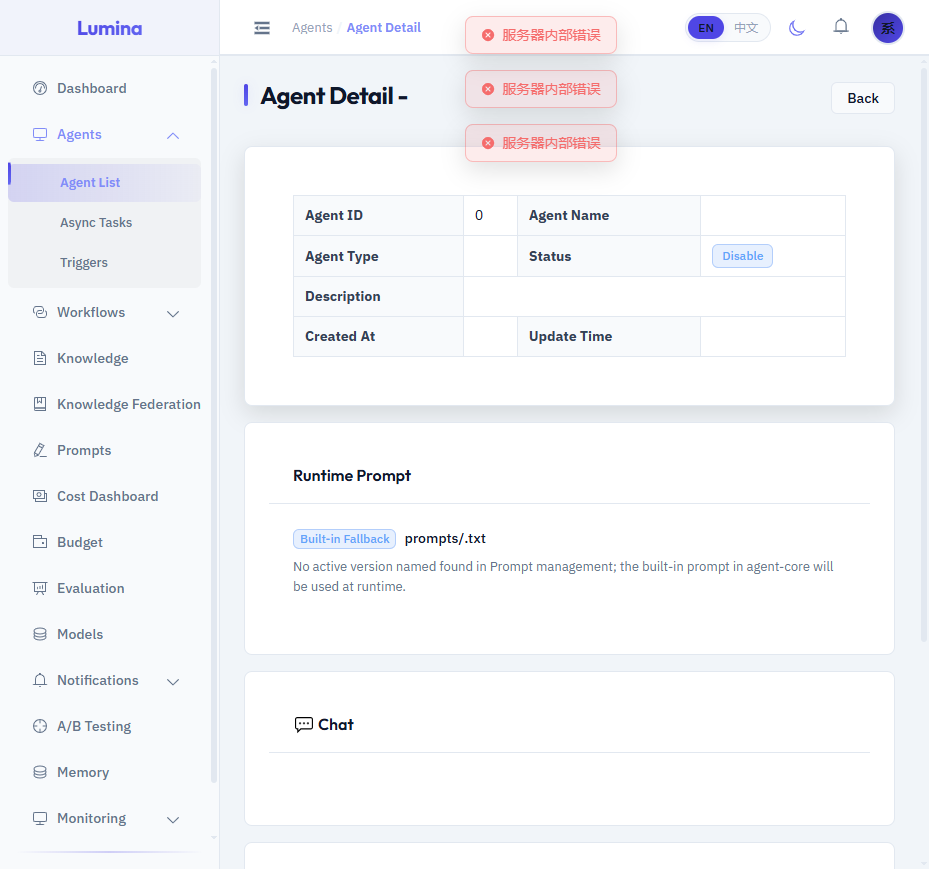

2. 在右侧 Chat 面板输入任务：`执行系统巡检：读取CPU/内存指标，读取Nginx和应用日志`
3. Agent 会调用 `ops.readMetrics` + `ops.readLogs` 读取数据，引用知识库 SOP 给建议

---

## ② 多模态执行

1. 先运行 `python3 examples/ops-platform/scripts/gen_chart.py` 生成图片
2. 在 Agent Chat 面板中点击上传按钮（📎）
3. 选择 `/tmp/lumina-ops/images/architecture.png`
4. 输入任务：`分析这张系统架构图，描述各组件`
5. Agent 通过多模态接口识别图片内容

---

## ③ RAG 检索验证

1. 先运行 `python3 examples/ops-platform/scripts/gen_mock_data.py --mode critical`
2. 在 Agent Chat 中输入：`系统出现大量 502 错误，请查询知识库给出排查步骤`
3. Agent 响应中应包含 Nginx SOP 的排查内容

---

## ⑥ DAG 工作流

1. 左侧菜单 → **Workflows**

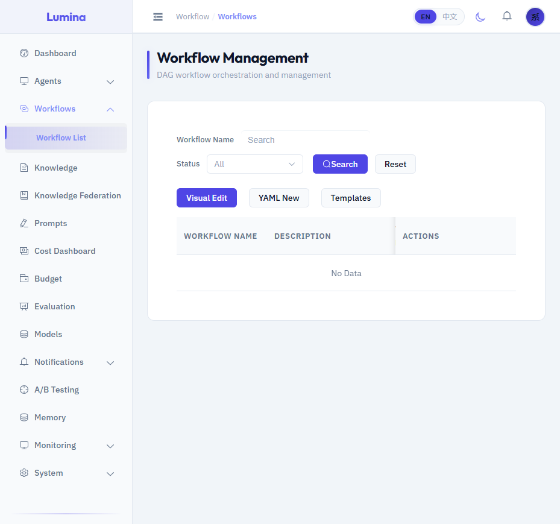

2. 点击「Create Workflow」
3. 将 `examples/ops-platform/config/workflow-dag.yaml` 内容粘贴到 YAML 编辑区
4. **重要**：将 `agentId: 1`/`2`/`3` 替换为实际 Agent ID
5. 保存 → 发布 → 执行

---

## ⑧ 人工审批

1. 工作流在 P0 场景下到 human 节点会暂停（状态 PAUSED）
2. 在实例详情页点击「审批」→ 选择 approve/reject
3. 工作流继续执行后续节点

---

## ⑨ Cron 定时触发器

1. 左侧菜单 → **Agents** → **Triggers**

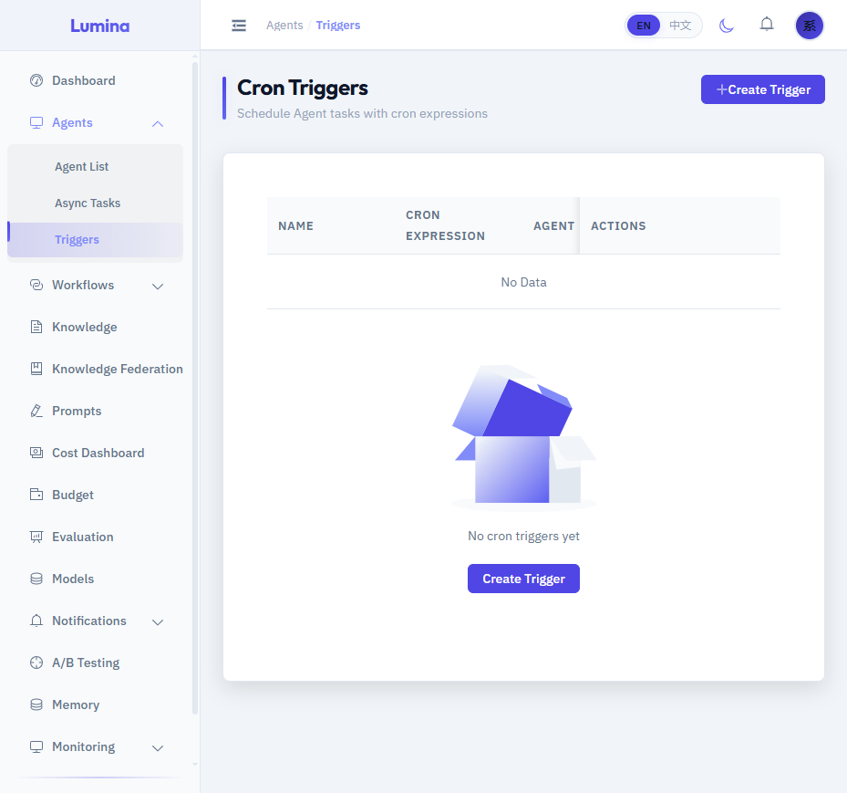

2. 点击「Create Trigger」
3. 填写：名称、目标 Agent、Cron 表达式 `0 0 * * * *`、任务输入
4. 保存后查看 next_fire_at

---

## ⑪ 预算控制

1. 左侧菜单 → **Budget**（预算管理）

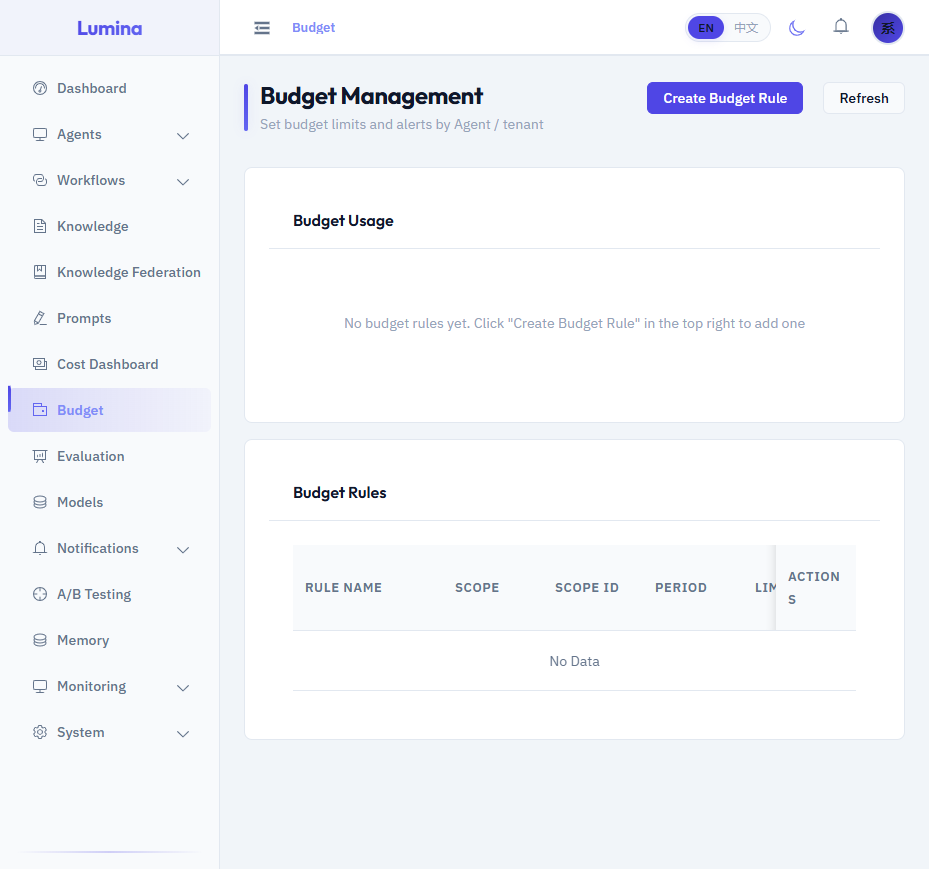

2. 点击「Create Rule」→ 填写作用域（AGENT）、周期（DAILY）、限额
3. 多次执行 Agent 后查看用量

---

## ⑬ Webhook 通知

1. 左侧菜单 → **Notifications** → **Webhooks**

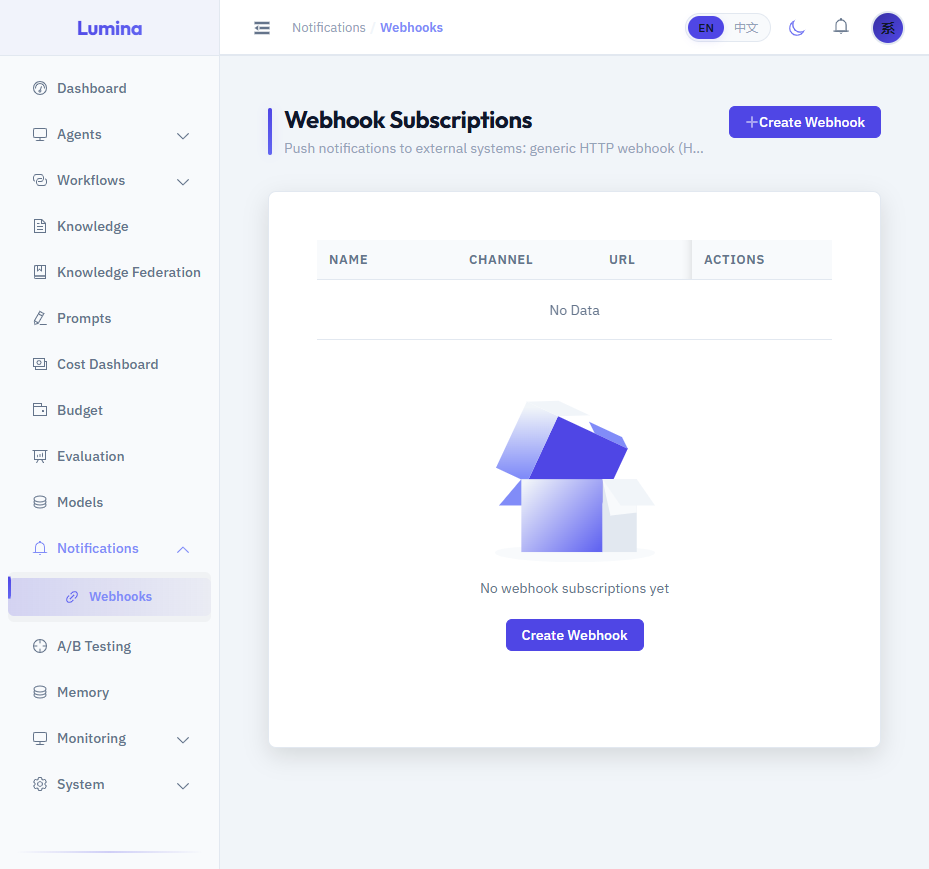

2. 点击「New Webhook」→ 填写 URL（指向 Python 接收端）、订阅事件
3. **保存密钥**（只显示一次）
4. 另一终端运行：`python3 webhook_receiver.py --port 9999 --secret <密钥>`
5. 点击「Test」→ 接收端终端打印通知

---

## ⑭ MCP 接入

> MCP 目前需通过 API 注册（前端暂无管理页面）：
```bash
curl -X POST http://localhost:8080/api/v1/mcp/servers \
  -H 'Authorization: Bearer <TOKEN>' \
  -d '{"name":"ops-fileserver","transport":"stdio","command":"python3","args":["examples/ops-platform/scripts/mcp_fileserver.py"]}'
```

---

## ⑮ 评估框架 + A/B 测试

### 评估

1. 左侧菜单 → **Evaluation**（Agent 评估）

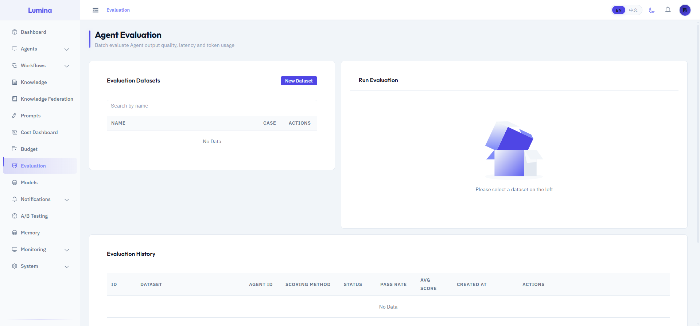

2. 点击「Import Dataset」→ 上传 `eval-dataset.yaml`
3. 选择数据集 → Run → 评分方式选 `LLM_JUDGE`

### A/B 测试

1. 左侧菜单 → **A/B Testing**

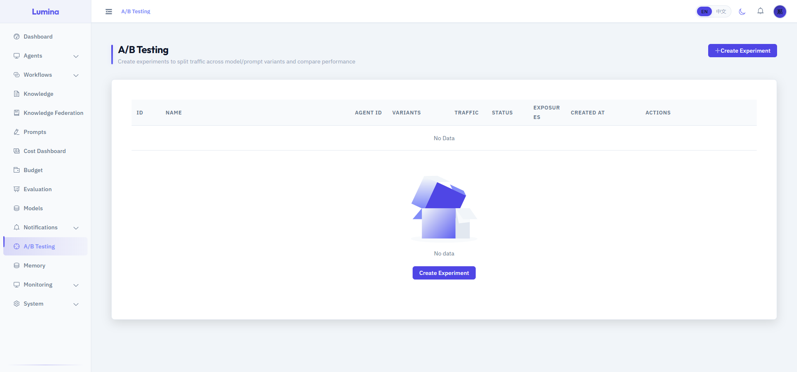

2. 先在 **Prompt 管理** 创建 2 个 Prompt 版本并发布

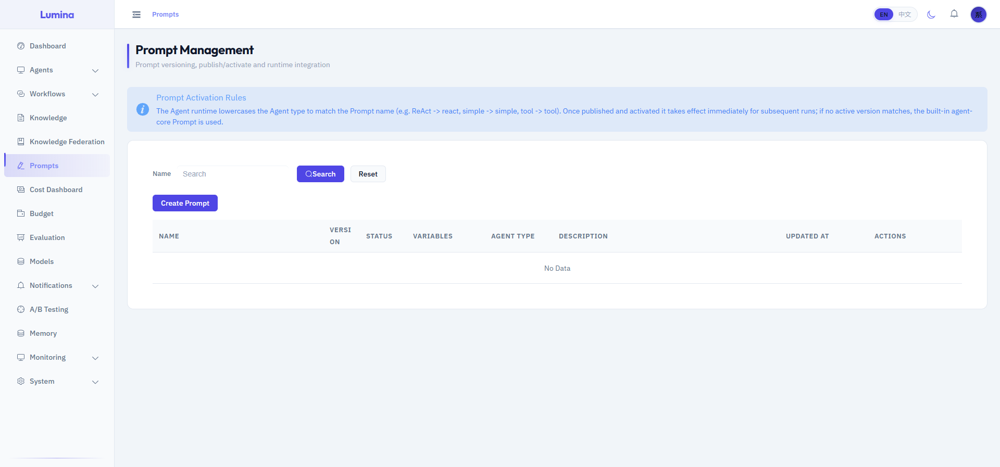

3. 创建实验 → 2 个变体分别绑定不同 Prompt → 启动

---

## ⑯ OpenAI 兼容端点

1. 左侧菜单 → **System** → **API Tokens**
2. 创建 Token → 保存 `sk-xxx`
3. 用 OpenAI SDK 调用：
```python
from openai import OpenAI
client = OpenAI(base_url="http://localhost:8080/v1", api_key="sk-xxx")
client.chat.completions.create(model="agent-1", messages=[...])
```

---

## ⑦ Flowable 工作流

1. 工作流管理页 → 创建 → 粘贴 `workflow-flowable.bpmn20.xml`
2. 替换 agentId → 发布 → 执行

---

## 贯穿能力

### 审计日志

左侧菜单 → **System** → **Audit Log**

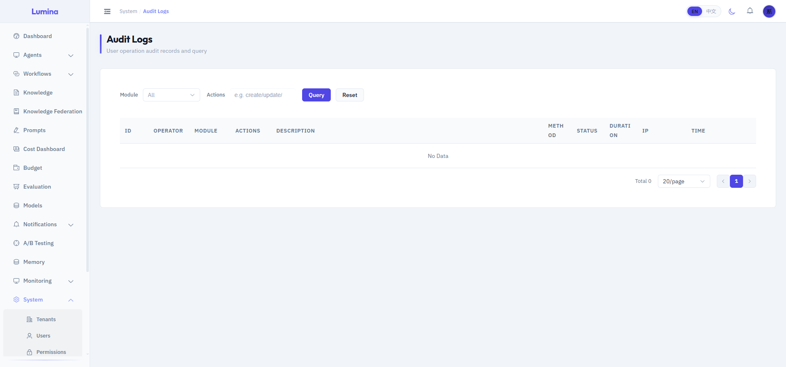

每次操作（创建/执行/删除）都有审计记录。

### 成本分析

左侧菜单 → **Cost**（成本仪表盘）

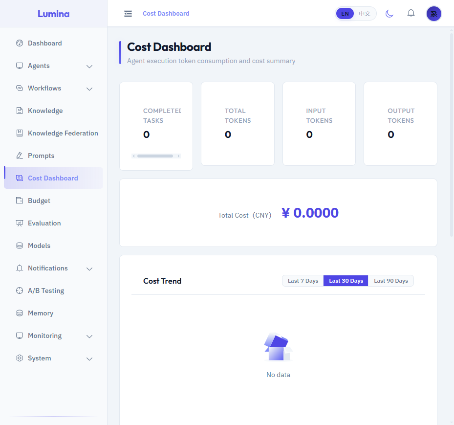

展示总费用、Token 用量、按 Agent/模型维度的费用分解。

### 中文切换

点击右上角「中文」按钮切换为中文界面：

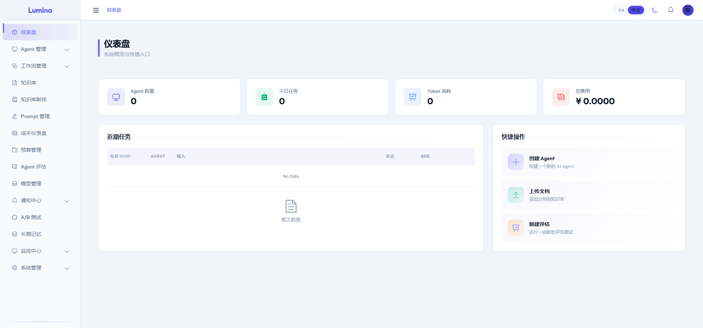

### 暗色模式

点击右上角「暗色主题」切换暗色：

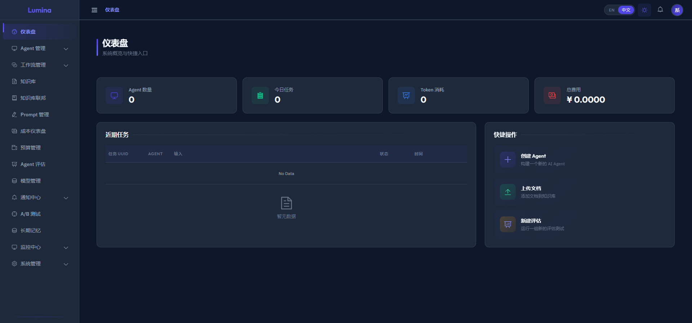

---

## 截图目录

所有截图存放在 `examples/ops-platform/docs/screenshots/`：

| 截图 | 内容 |
|------|------|
| 00-dashboard.png | Dashboard 总览 |
| 01-knowledge-base.png | 知识库文档 tab |
| 02-kb-empty.png | 知识联邦 tab（空状态） |
| 03-kb-create-dialog.png | 创建知识库对话框 |
| 04-kb-created.png | 知识库创建成功 |
| 05-agent-list.png | Agent 列表（空） |
| 06-agent-list-with-data.png | Agent 列表（含运维 Agent） |
| 07-agent-detail.png | Agent 详情页（Chat 面板） |
| 08-agent-edit.png | Agent 编辑页（工具/KB/限流配置） |
| 09-workflow-list.png | 工作流管理 |
| 10-triggers.png | 定时触发器 |
| 11-webhooks.png | Webhook 订阅 |
| 12-budget.png | 预算管理 |
| 13-cost.png | 成本仪表盘 |
| 14-evaluation.png | Agent 评估 |
| 15-ab-test.png | A/B 测试 |
| 16-audit.png | 审计日志 |
| 17-prompt.png | Prompt 管理 |
| 18-chinese-mode.png | 中文模式 |
| 19-dark-mode.png | 暗色模式 |
