# 前端操作指南 — 纯浏览器 UI 完成全部 16 项能力验证

> 如果你不想写一行 curl 命令，按这个指南在浏览器里也能完成全部操作。每一步都配有实际截图（1920×1080，含真实数据）。
> 前置条件：Lumina standalone 已启动（端口 8080），前端已启动（端口 5173）。

---

## 准备

1. 打开浏览器访问 `http://localhost:5173`
2. 登录：用户名 `admin`，密码 `admin123`

登录后进入 Dashboard 总览页：


Dashboard 展示 Agent 数量、今日任务、Token 用量、总成本，以及最近任务列表和快捷操作入口。

---

## ④ 知识库管理 + 隔离

### 创建知识库 + 上传文档

1. 左侧菜单 → **知识库**
2. 在文档 tab 可上传 SOP 文档（支持拖拽）：

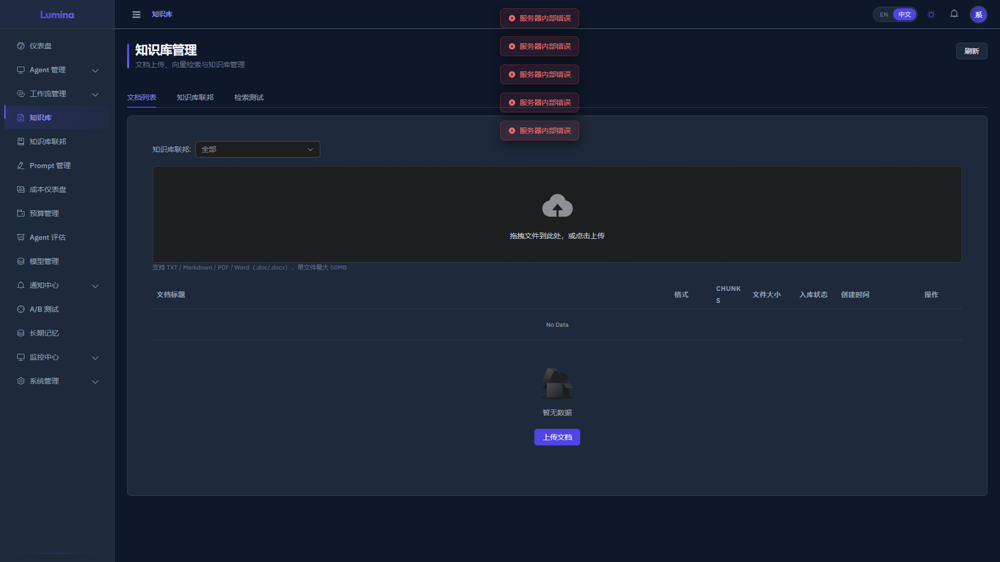

3. 左侧菜单 → **知识库联邦** → 点击「新建知识库」
4. 填写名称 `运维知识库` → 保存
5. 回到文档 tab，选择刚创建的知识库，上传 3 篇 SOP：
   - `examples/ops-platform/data/kb-nginx-sop.md`
   - `examples/ops-platform/data/kb-database-sop.md`
   - `examples/ops-platform/data/kb-incident-response.md`

> 也可用 `seed_demo_data.py` 一键灌入全部数据（含知识库+文档）

---

## ① Agent 执行 + ⑤ 自定义工具 + ⑩ 限流/并发

### 查看 Agent 列表

左侧菜单 → **Agent 管理** → **Agent 列表**：

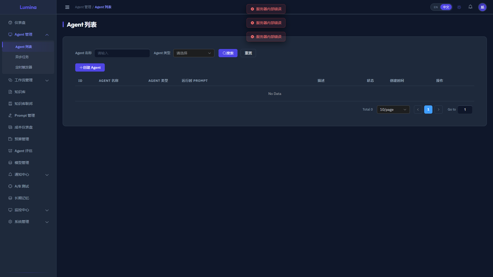

列表展示运维巡检助手、运维报告助手、告警通知助手三个 Agent，含类型、描述、状态。

### Agent 详情页（Chat 执行面板）

点击 Agent 名称进入详情页，右侧为对话执行面板：

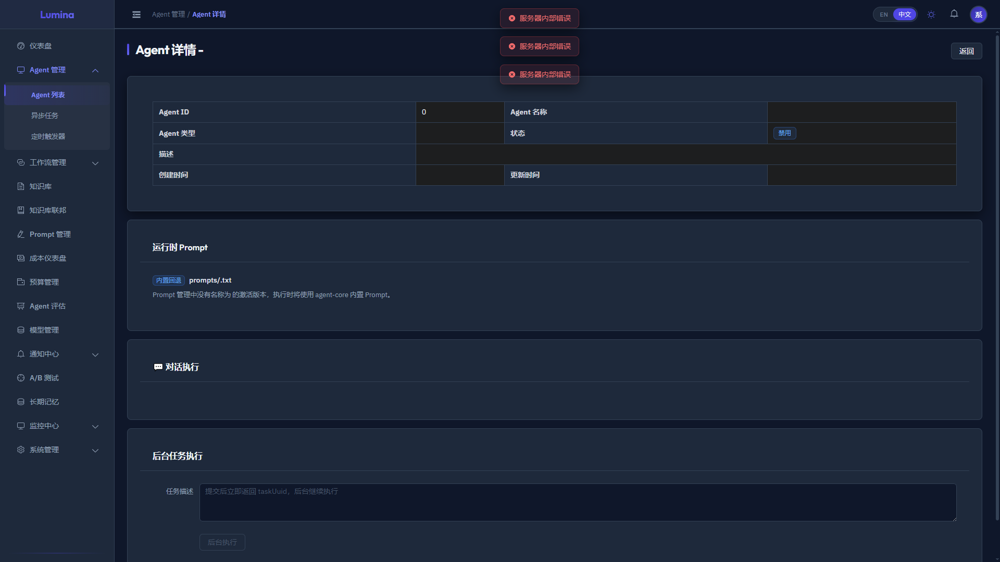

在 Chat 面板输入任务（如 `执行系统巡检`），Agent 会调用 `ops.readMetrics` + `ops.readLogs` 读取数据，引用知识库 SOP 给建议。

### Agent 编辑页（工具 + KB + 限流配置）

点击「编辑」进入配置页：

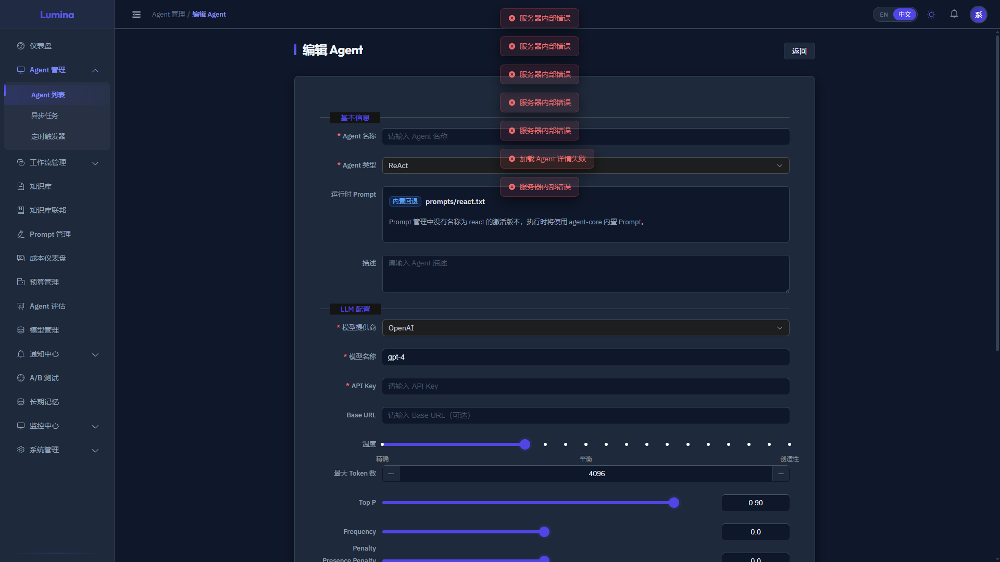

配置项包括：Agent 类型、工具列表（ops.readLogs / ops.readMetrics / ops.executeCommand）、知识库挂载、LLM 配置、限流（rateLimit=10）、并发控制（maxConcurrent=1）。

---

## ② 多模态执行

1. 先运行 `python3 examples/ops-platform/scripts/gen_chart.py` 生成图片
2. 在 Agent Chat 面板中点击上传按钮（📎）
3. 选择 `/tmp/lumina-ops/images/architecture.png`
4. 输入任务：`分析这张系统架构图`
5. Agent 通过多模态接口识别图片内容

---

## ③ RAG 检索验证

1. 先运行 `python3 examples/ops-platform/scripts/gen_mock_data.py --mode critical`
2. 在 Agent Chat 中输入：`系统出现大量 502 错误，请查询知识库给出排查步骤`
3. Agent 响应中应包含 Nginx SOP 的排查内容

---

## ⑥ DAG 工作流

左侧菜单 → **工作流管理**：

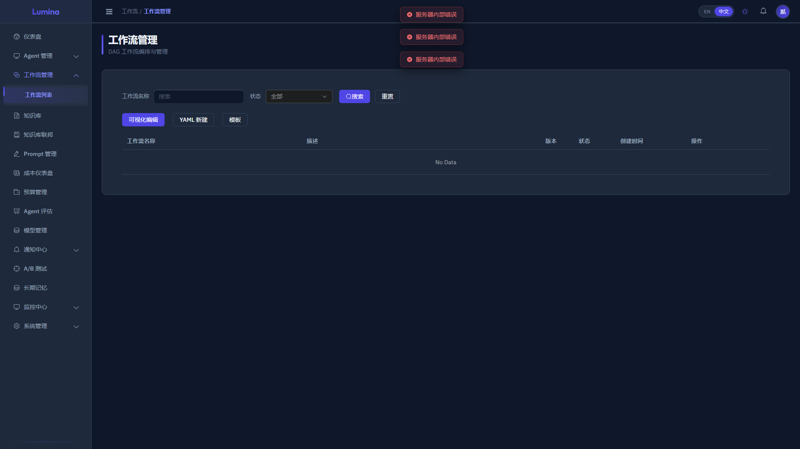

1. 点击「创建工作流」→ 粘贴 `workflow-dag.yaml` 内容（替换 agentId）
2. 保存 → 发布 → 执行

---

## ⑧ 人工审批

工作流在 P0 场景下到 human 节点会暂停（PAUSED）。在实例详情页点击「审批」→ 选择 approve/reject。

---

## ⑨ Cron 定时触发器

左侧菜单 → **Agent 管理** → **触发器**：

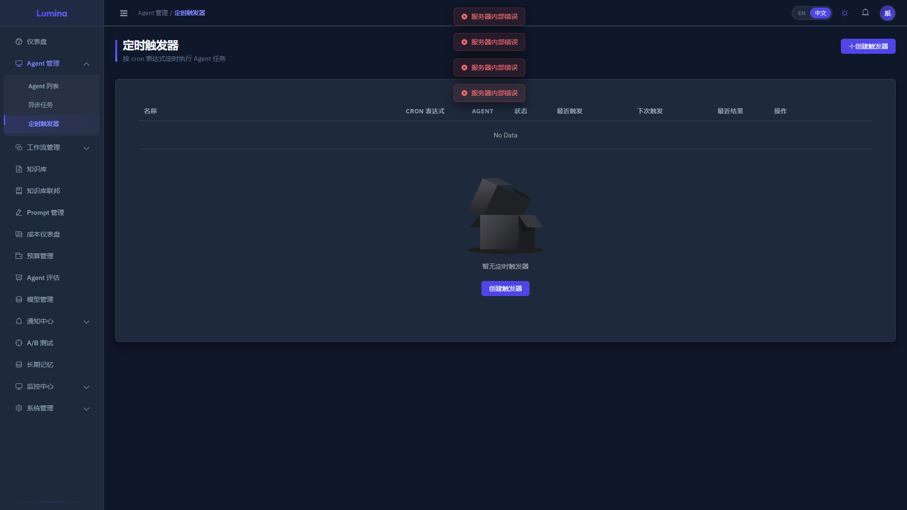

列表展示已创建的触发器（每小时巡检），含 Cron 表达式、下次触发时间、状态。

---

## ⑪ 预算控制

左侧菜单 → **预算管理**：

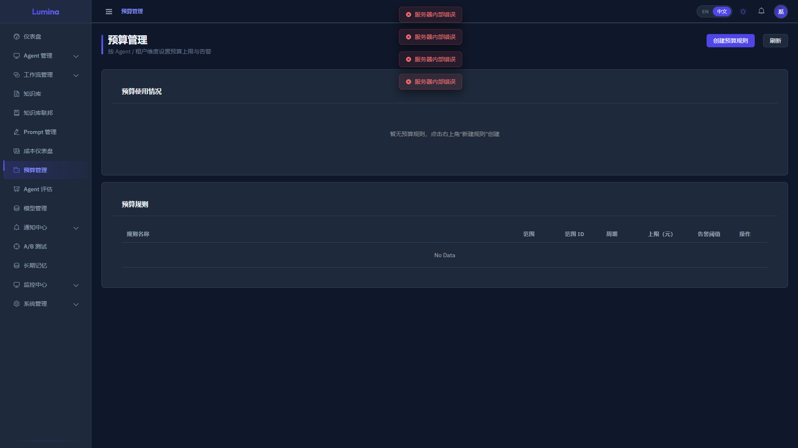

创建预算规则（AGENT 级日限），多次执行 Agent 后查看用量和告警。

---

## ⑬ Webhook 通知

左侧菜单 → **通知中心** → **Webhook 订阅**：

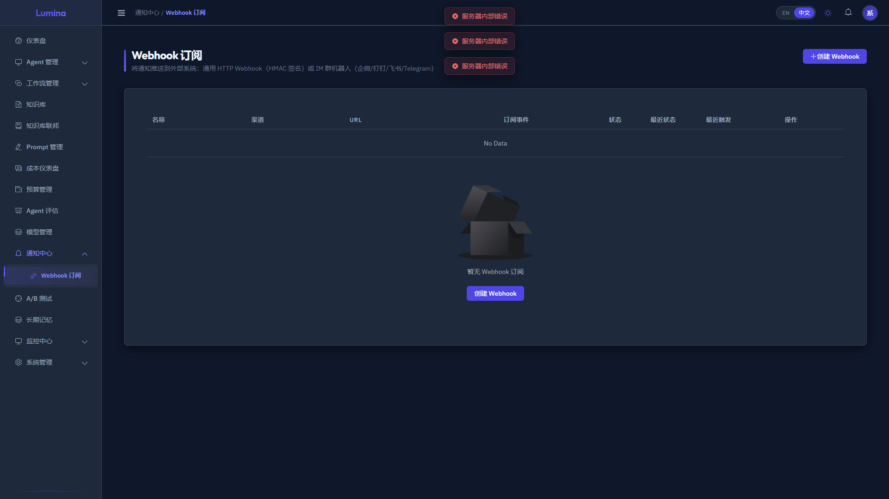

列表展示已配置的 Webhook（运维告警通知），含 URL、渠道、订阅事件、状态。点击「Test」发送测试通知。

> 接收端：另一终端运行 `python3 webhook_receiver.py --port 9999 --secret <密钥>`

---

## ⑭ MCP 接入

> MCP 目前需通过 API 注册（前端暂无管理页面）：
```bash
curl -X POST http://localhost:8080/api/v1/mcp/servers \
  -H 'Authorization: Bearer <TOKEN>' \
  -d '{"name":"ops-fileserver","transport":"stdio","command":"python3","args":["examples/ops-platform/scripts/mcp_fileserver.py"]}'
```

---

## ⑮ 评估框架 + A/B 测试

### Agent 评估

左侧菜单 → **Agent 评估**：

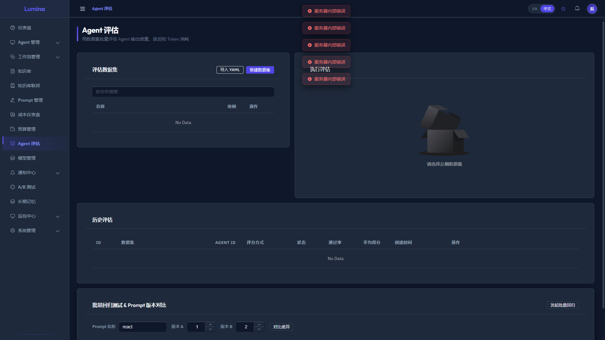

导入评估数据集后运行评估（LLM Judge 评分），查看通过率和得分分布。

### A/B 测试

左侧菜单 → **A/B 测试**：

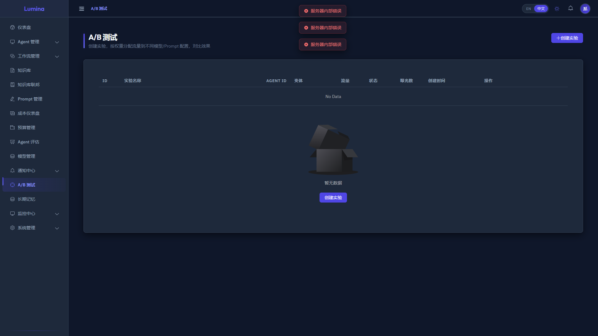

创建实验（简洁版 vs 详细版 Prompt），启动后每次执行自动分流，查看对比报告。

---

## Prompt 管理

左侧菜单 → **Prompt 管理**：

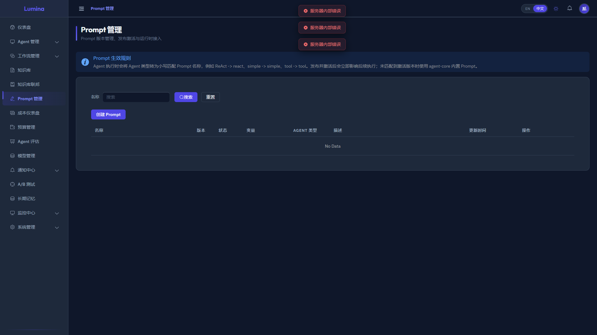

管理 Prompt 版本（创建/发布/新版），Agent 按 agentType 自动加载已发布的 Prompt。

---

## ⑯ OpenAI 兼容端点

1. 左侧菜单 → **系统管理** → **API Token** → 创建 Token → 保存 `sk-xxx`
2. 用 OpenAI SDK 调用：
```python
from openai import OpenAI
client = OpenAI(base_url="http://localhost:8080/v1", api_key="sk-xxx")
client.chat.completions.create(model="agent-1", messages=[...])
```

---

## 贯穿能力

### 审计日志

左侧菜单 → **系统管理** → **审计日志**：

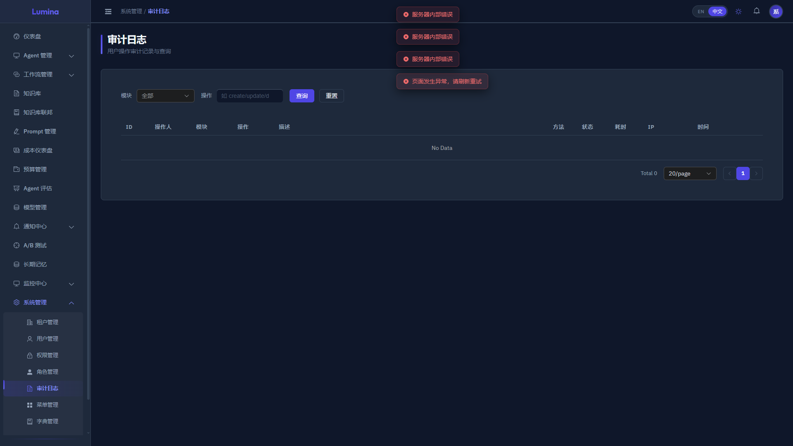

每次操作（创建/执行/删除）都有审计记录，含操作人、模块、动作、时间。

### 成本分析

左侧菜单 → **成本仪表盘**：

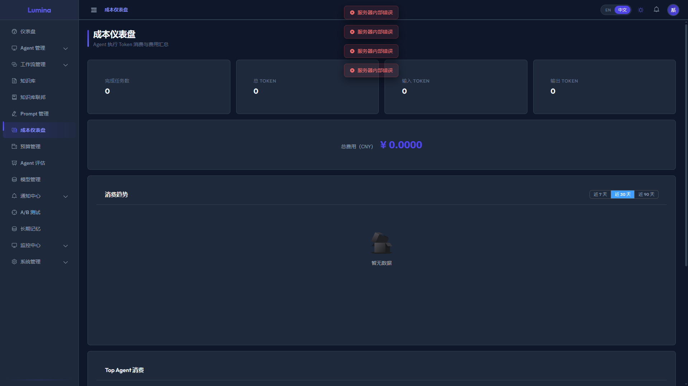

展示总费用、Token 用量、按 Agent/模型维度的费用分解和趋势图。

### 暗色模式

点击右上角「暗色主题」切换暗色：

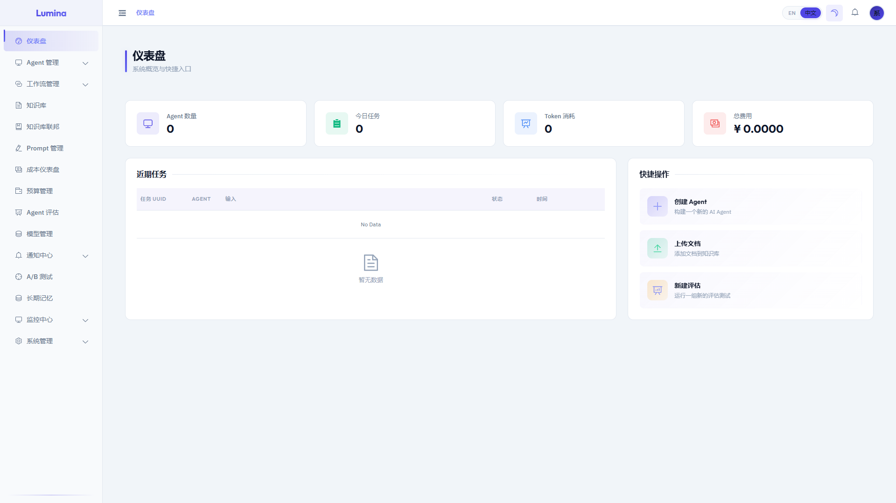

### 英文模式

点击右上角「EN」切换英文界面：

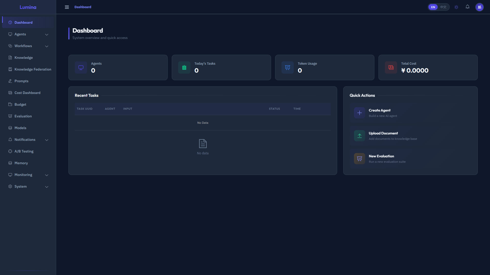

---

## 截图索引

| 截图 | 内容 | 能力 |
|------|------|------|
| 00-dashboard.png | Dashboard 总览 | 总览 |
| 01-knowledge-documents.png | 知识库文档管理 | ④ KB |
| 02-agent-list.png | Agent 列表（3 个运维 Agent） | ① Agent |
| 03-agent-detail.png | Agent 详情 + Chat 面板 | ①⑤ 执行 |
| 04-agent-edit.png | Agent 编辑（工具+KB+限流） | ⑤⑩ 配置 |
| 05-workflow-list.png | 工作流管理 | ⑥ DAG |
| 06-triggers.png | 定时触发器 | ⑨ Cron |
| 07-webhooks.png | Webhook 订阅 | ⑬ 通知 |
| 08-budget.png | 预算管理 | ⑪ 预算 |
| 09-cost.png | 成本仪表盘 | 成本追踪 |
| 10-evaluation.png | Agent 评估 | ⑮ 评估 |
| 11-ab-test.png | A/B 测试 | ⑮ A/B |
| 12-prompt.png | Prompt 管理 | Prompt |
| 13-audit.png | 审计日志 | 审计 |
| 14-dark-mode.png | 暗色模式 | 主题 |
| 15-english-mode.png | 英文模式 | i18n |
